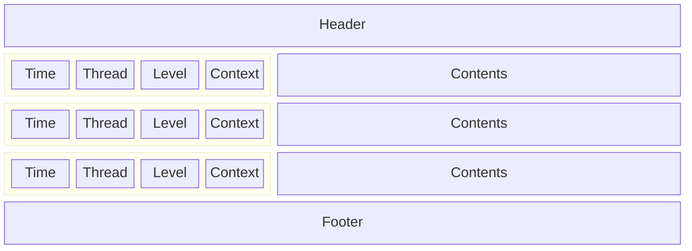
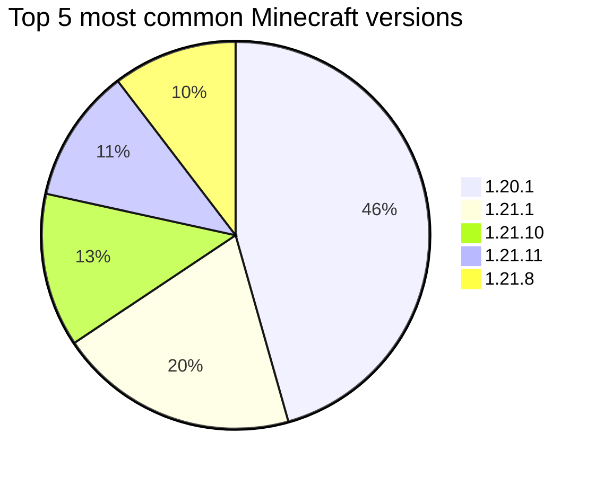

# Polyhedron

Prism / MultiMC log parsing & analysis library

## Parsing

A log has the following structure. The header contains information such as mods, Java args, and other information known before starting the game and some information from the launcher pre-initialization phase. The entries after contain various timestamped events from the initialization phase and everything from when the game is running. The footer contains the exit code and if applicable other information such as JRE crash information.



Polyhedron is written to allow streaming data from logs, whether that be from a HTTP request stream or from an actively running game. This is why most checks work with `LogEntry`'s instead of reading the log as as string.

## Header parsing (`src/header`)

The header is initially indexed to find standard positions (`src/header/index.rs`). This is done to reduce parsing complexity and improve performance. This produces the `IndexedLogHeader` which is used in all the checks. It can be used to extract used mods, MC info, Java info, libraries etc.


Most commonly used Minecraft versions based on headers of 4.6k logs (2026-03)

## Log entry parsing (`src/entries`)

Log entries are parsed into a `LogEntry` struct with separate fields for each "column". This allows for filtering based on log level, thread, or class context. It also makes it easier to more reliably parse the contents of log entries such as stacktraces. It supports a wide variety of log formats and localization options.

**Unparsed**
```
[18:33:36] [main/WARN]: Reference map 'xaerominimap.refmap.json' for xaerominimap.mixins.json could not be read. If this is a development environment you can ignore this message
[18:33:36] [main/WARN]: Reference map 'yet_another_config_lib_v3.refmap.json' for yacl-fabric.mixins.json could not be read. If this is a development environment you can ignore this message
[18:33:36] [main/WARN]: Error loading class: net/raphimc/immediatelyfast/feature/core/BatchableBufferSource (java.lang.ClassNotFoundException: net/raphimc/immediatelyfast/feature/core/BatchableBufferSource)
[18:33:36] [main/WARN]: Error loading class: net/irisshaders/batchedentityrendering/impl/FullyBufferedMultiBufferSource (java.lang.ClassNotFoundException: net/irisshaders/batchedentityrendering/impl/FullyBufferedMultiBufferSource)
[18:33:37] [main/WARN]: Error loading class: dev/isxander/controlify/virtualmouse/VirtualMouseHandler (java.lang.ClassNotFoundException: dev/isxander/controlify/virtualmouse/VirtualMouseHandler)
[18:33:37] [main/WARN]: @Mixin target dev.isxander.controlify.virtualmouse.VirtualMouseHandler was not found mixins.ipnext.json:MixinVirtualMouseHandler from mod inventoryprofilesnext
[18:33:37] [main/WARN]: Force-disabling mixin 'features.render.world.sky.LevelRendererMixin' as rule 'mixin.features.render.world.sky' (added by mods [iris]) disables it and children
[18:33:38] [main/INFO]: Starting Essential Loader (stage2) version 1.6.6 (64b13bbd248a9bb10a3dc68389eacdcc) [stable]
[18:33:39] [main/INFO]: Starting Essential v1.3.10.4 (#9adecc609e) [stable]
[18:33:39] [main/INFO]: Java: OpenJDK 64-Bit Server VM (v21.0.7) by Microsoft (Microsoft)
[18:33:39] [main/INFO]: Java Info: mixed mode
```

**Parsed**
|Hour|Minute|Second|Thread|Level|Contents|
|-|-|-|-|-|-|
|18|33|36|main|WARN|Reference map 'xaerominimap.refmap.json' for xaerominimap.mixins.json could not be read. If this is a development environment you can ignore this message|
|18|33|36|main|WARN|Reference map 'yet_another_config_lib_v3.refmap.json' for yacl-fabric.mixins.json could not be read. If this is a development environment you can ignore this message|
|18|33|36|main|WARN|Error loading class: net/raphimc/immediatelyfast/feature/core/BatchableBufferSource (java.lang.ClassNotFoundException: net/raphimc/immediatelyfast/feature/core/BatchableBufferSource)|
|18|33|36|main|WARN|Error loading class: net/irisshaders/iris/layer/InnerWrappedRenderType (java.lang.ClassNotFoundException: net/irisshaders/iris/layer/InnerWrappedRenderType)|
|18|33|37|main|WARN|Error loading class: dev/isxander/controlify/virtualmouse/VirtualMouseHandler (java.lang.ClassNotFoundException: dev/isxander/controlify/virtualmouse/VirtualMouseHandler)|
|18|33|37|main|WARN|@Mixin target dev.isxander.controlify.virtualmouse.VirtualMouseHandler was not found mixins.ipnext.json:MixinVirtualMouseHandler from mod inventoryprofilesnext|
|18|33|37|main|WARN|Force-disabling mixin 'features.render.world.sky.LevelRendererMixin' as rule 'mixin.features.render.world.sky' (added by mods [iris]) disables it and children|
|18|33|38|main|INFO|Starting Essential Loader (stage2) version 1.6.6 (64b13bbd248a9bb10a3dc68389eacdcc) [stable]|
|18|33|39|main|INFO|Starting Essential v1.3.10.4 (#9adecc609e) [stable]|
|18|33|39|main|INFO|Java: OpenJDK 64-Bit Server VM (v21.0.7) by Microsoft (Microsoft)|
|18|33|39|main|INFO|Java Info: mixed mode|

## Issue detection (`src/issues`)

`src/issues/issue.rs` contains an enum that represent all detectable issues. `src/issues/checks` contains various checks that produce these issues based on the header, log entries, stacktraces, and / or exit code.